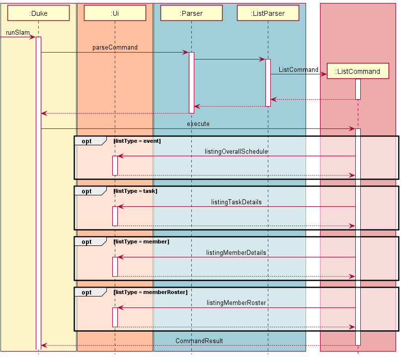
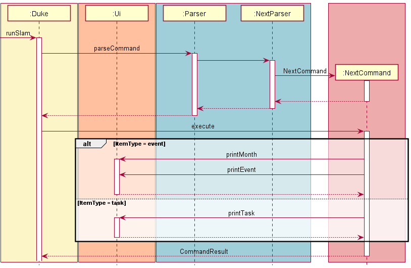
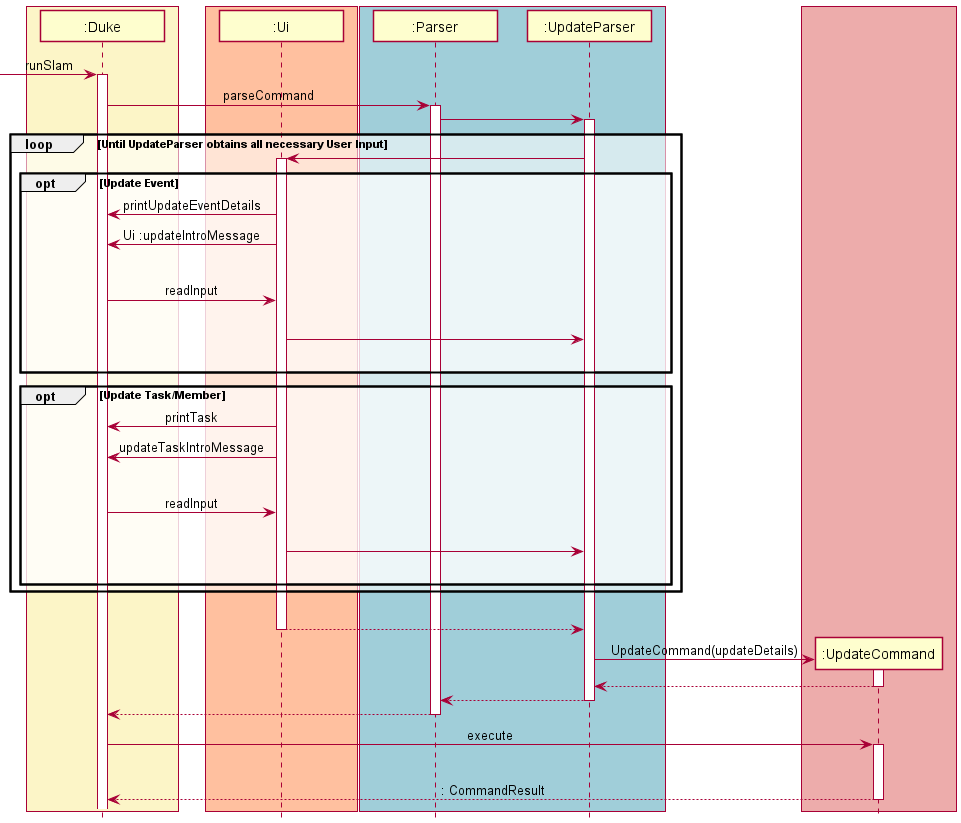

# Developer Guide
Welcome to **SLAM**! **SLAM** is a desktop application for student group leaders in NUS to manage their group events, tasks, members and various activities. This application allows you to effectively plan and manage the organisation of events by allowing users to create and add such events to their schedule. Leading up to the actual date and time of the event, committee heads can add tasks (e.g. meetings, purchase of logistics) to complete under each event to keep track of progress. Group members can also be added and assigned to these tasks. This application uses a Command Line Interface (CLI); that is, the application is operated by typing commands into a Command Box.

---
# Table of Contents
1. [Introduction](#Introduction)
   1. [Purpose of This Guide](#Purpose of Developer Guide)
2. [Acknowledgements](#Acknowledgements)
3. [Design](#Design)
   1. [Architecture](#Architecture)
   2. [Ui component](#Ui component)
   3. [Logic component](#Logic component)
   4. [Storage component](#Storage component)
4. [Implementation](#Implementation)
   1. [List Functionality](#List Functionality)
   2. [Next Functionality](#Next Functionality)
   3. [Update Functionality](#Update Functionality)
   4. [Delete Functionality](#Delete Functionality)
   5. [Select Functionality](#Select Functionality)
5. [Product Scope](#Product scope)
   1. [Target user profile](#Target user profile)
   2. [Value proposition](#Value proposition)
6. [User Stories](#User Stories)
7. [Non-Functional Requirements](#Non-Functional Requirements)
8. [Glossary](#Glossary)
9. [Instructions for manual testing](#Instructions for manual testing)

## Introduction

SLAM is a **command line interface application** for student group leaders in NUS to **manage their group 
events, tasks and members**, without the need for much programming knowledge. This application allows student leaders to plan and manage the organisation 
of various events by allowing users to add custom events to their schedule. Users can add tasks to complete 
under each event and keep track of the progress of such tasks and events. 
These tasks also have group members assigned to them from a user-generated roster of members. 
The simple interaction between the **User** and the **command line interface application** makes SLAM an extremely user friendly
and usable event planner for student leaders.

### Purpose of Developer Guide
To give an overview on the application, namely overall architecture, implementation design rational, and specificities
in the algorithms used within SLAM. To get a good grasp of how the application works, it is recommended to look at the Overall Architecture
section of this guide.

## Acknowledgements

{list here sources of all reused/adapted ideas, code, documentation, and third-party libraries -- include links to the original source as well}

## Design

This section describes some noteworthy details on how certain features are designed and implemented within SLAM.

### Architecture
Below displays how the overall flow and implementation of the application is executed.

The architecture of the entire application revolves around a few different components.
* `Ui` : This component is responsible for the information displayed to the user from the command line interface.
* `Parser` : This component parses the different data keyed in from the user and prepares the relevant data required to execute the commands.
* `Commands` : These components executes the different commands parsed by the parser from the inputs of the User.
* `Items` : Represents the different types of items (events, tasks and members) that can be assigned and implemented within the application.
* `Storage` : Manages the writing and reading of data to and from the disk.

The interaction of all the different components within the application can be depicted as such.

### Ui component

**API**: `Ui.java`

Below is a brief class diagram of the UI component

The UI component,
* executes the different user commands using the `Logic` component.
* looks out for changes in the `Command` and `Parser` classes so that the UI can be updated to display to the user the latest data of the application.
* Manages the access to the `Scanner` object that reads user input.
* is the bridge between the user and the `Logic` component.
* contains all the methods for printing to the User.

### Logic component

**API**: `Parser.java` 

Below is a partial class diagram that shows na overview of the `Logic` component.

How the `Logic` component works:
1. When `Logic` is called upon to execute a command it uses the abstract `Parser` class to parse the UserCommand.
2. The `Parser` then calls the specified abstract `Parser` class to be called. For example, `DeleteParser` will be command when a `delete` command is keyed in by the user.
3. `DeleteParser` will then parse the necessary information from the Users input.
4. This results in  `Command` object (more precisely, an object of one of its subclasses e.g. `DeleteCommand`) being returned.
5. `Duke` then calls `execute()` within the `Command` object which then executes the specified command.
6. Upon the completion of `execute()` an object of type `CommandResult` is returned to `Duke` and the feedback is displayed to the User
7. Within the `Parser` classes, all the input of the User will also be checked to ensure that no error messages come up during execution

### Storage component

**API**: `Storage.java`

#### Save Functionality

How the `save` functionality works:
1. When the `save` method is called, `StorageFile` constructs a new `File` object using the configured `DEFAULT_FILE_PATH`.
2. The presence of the `File` object on the local system is checked. The `data` directory and `slamData.txt` file wil be created if they are absent.
3. The `Member` objects in the provided `memberRoster` will be encoded into a list of `String` objects via the `encodeMemebersList` method.
4. The `Event` objects in the provided `eventCatalog` along with their respective lists of `Task` objects will be encoded into a list of `String` objects via `encodeEventsList`.
5. The `writeToFile` method will be called to write the encoded lists of `String` data into the `.txt` save file locally for future uses of the program.

#### Load Functionality

How the `load` functionality works:
1. When the `loadSaveFile` method is called, `StorageFile` constructs a new `File` object using the configured `DEFAULT_FILE_PATH`.
2. The returned `File` object will then be parsed into an `ArrayList<String>` of `encodedLines` through the `getStringsFromFile` method.
3. If the detected line contains data regarding a `Member` or `Event` object, the `StorageFile` instance will decode and construct the `Member` and `Event` objects, adding them to the global `MemberRoster` and `EventCatalog` respectively.
4. If the detected line contains data regarding a `Task` object:
   1. The `decodedTask` object will be decoded from the respective line and returned via `decodeTaskFromString`.
   2. The `decodedTask` will be added to the `Event` object's list of tasks within the global `eventCatalog`.
   3. `Member` objects in the global `memberRoster` that this `decodedTask` contains will also have their list of tasks updated to contain this `decodedTask`.

>💡 When decoding an invalid line (possibly from unwanted edits to `slamData.txt` by the user), `loadSaveFile` will throw an appropriate exception and provide feedback regarding the invalid line to the user.

## Implementation

This section aims to explain the specfic application functionalities and the interactions between the classes and their methods

>💡 The lifeline of the objects should terminate at the destroy marker (`X`), however due to a limitation of the PlantUML software, the lifeline extends beyond the destroy marker.

### Commands

The commands represent the different tasking that the application can complete and the different user specific functionalities within the application

Here is a brief overview of the different Commands
* List
* Next
* Update
* Delete
* Select
* Find
* Add
* Help
* DoneUndo
* Bye

#### List Functionality

Below is a brief overview of how the list Functionality works.

How List works:
1. Duke will call `Parser` to parse through the user inputs, when `list` is detected, `ListParser` will be called.
2. `ListParser` will parse through the user inputs, and create a new `ListCommand` object, which will be returned to Duke.
7. `Duke` then calls the `execute` method in `ListCommand` which will then return an object of type `CommandResult` and would print out the list corresponding to the `listType` in chronological order.
8. list can display 4 types of list depending on the `listType` .
9. `list -e` : to list the Overall Schedule .
10. `list -m` : to list all the members in the Overall Members List.
11. `list -t [Event_Num]` : to display all the tasks in a unique Event.
12. `list -m e/[Event Index] t/[Task Index]` : to display all the members involved in a specific task.

#### Next Functionality

Below is a brief overview of how the next Functionality works.

How Next works:
1. When `next` is input by the User, the `Parser` class will call `NextParser`.
2. The `NextParser` class will check and parse the user input, to see which item, to user wants to see next.
3. The `NextParser` then creates a `NextCommand` object, and sets the relevant date based on the parsed user input.
4. `Duke` then calls `execute` within the `NextCommand` where in it will display the most upcoming event or task depending on the user input.
5. `-t [Event_Index]` will display next upcoming task and `-e` will display next upcoming event.

#### Update Functionality

How Updating works:
1. When the `Parser` class parses `update` it will call `UpdateParser` where the Type of the update will be determined
2. Based on the Type of update (Whether updating `event details` or `task details`) the `UpdateParser` through the `Ui` will get the relevant information from the user
3. Once the relevant information is parsed `UpdateParser` will create a new `UpdateCommand` based on the type of update (eg. `UpdateEventCommand` to update details of an event)
6. `Duke` then calls the `execute`  method in the respective `UpdateCommand` where the updates will be implemented
8. Once all the updates are completed, `UpdateCommand` will return a `postUpdateMessage()` along with `CommandResult` object to show the User the result of the Updates

#### Delete Functionality
How deleting works:

1. When the `Parser` class parses `delete` as the command from the user, a new `Command` object, `DeleteCommand` is created.
2. The `DeleteCommand` constructor processes the entire input from the user by calling `prepareInputs`.
3. `DeleteCommand` has 3 uses: deleting an `Event`, a `Task`, or to delete all `Event`s through the command `delete all`.
4. The constructor processes the usage for `DeleteCommand` and executes the actual deletion through `execute` which returns a `CommandResult` object with the associated deletion message from the `Ui` class.
5. `delete all` will not immediately invoke the `clear()` method on the global `eventCatalog` ArrayList and will instead prompt a confirmation from the user before deleting all `Event`s.

#### Select Functionality

How selecting an `Event` or an event's nested `Task` works:
1. When the `Parser` class parses `select` as the command from the user, a new `Command` object, `SelectCommand` is created.
2. If the command contains a valid flag (`-e` or `-t`), `SelectCommand` processes the input from the user by calling `prepareInputs`.
3. If the user selects an `Event`, `SelectCommand` updates the index of this `Event` in `Parser`.
4. `SelectCommand` then passes the processed inputs back to `Parser`, which passes it back to `Duke`.
5. `Duke` then calls the `execute` method in `SelectCommand` which will return an object of type `CommandResult`, and the respective output will be printed.

## Product scope
### Target user profile

The target user profile for our application are university Student leaders, who are required to manage various club events and peope
1. Is a student leader of multiple groups
2. Has to plan multiple event within a given AY
3. Has many members to account for
4. Is comfortable typing and using the CLI

### Value proposition

This application helps to organise the details of multiple events and tasks for various student leaders. As student leaders
people often have to manage not only the multiple extra-curricular groups they are involved in but also their own studies. 
This can often be a hassle and difficult for student leaders to manage, thus this program aims to directly deal with this issue
and provide Student leaders, with an application to cater to their specific managerial needs.

## User Stories

|Version| As a ... | I want to ... | So that I can ...|
|--------|----------|---------------|------------------|
|v1.0|new user|see usage instructions|refer to them when I forget how to use the application|
|v2.0|user|find a to-do item by name|locate a to-do without having to go through the entire list|

## Non-Functional Requirements

1. Should work on any *mainstream OS* as long as it has java `11` or above installed.
2. Should be able to hold up to 100 different events without noticeable issues, developing with the application.
3. User with above average typing speed, should be able to manage, and use the application to plan and organise events faster than other event planning applications.

## Glossary

* **Mainstream OS** -  Windows, Linux, Unix, OS-X

## Instructions for manual testing

{Give instructions on how to do a manual product testing e.g., how to load sample data to be used for testing}
